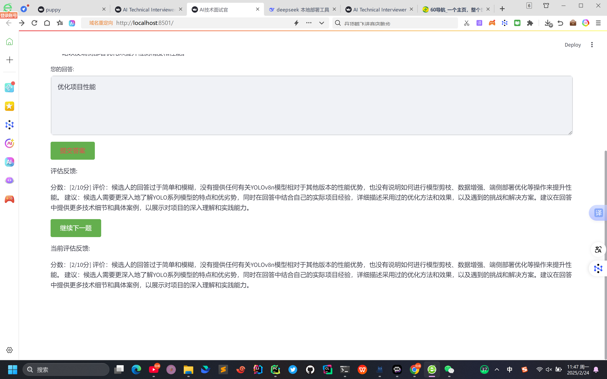

# AI interviewers

# 需要提交的资料
上传pdf版本的简历
上传招聘JD(optional)

# 应用场景

## 针对应聘者
AI模拟面试

## 针对每个公司
0轮面试是ai面试 进行初步筛选 可以给企业定制化 节省面试官的时间

## 针对猎头
可以针对某个方位进行定制化 将之前的面试者的信息整理 题目 辅助下一位面试者

## api

### 本地部署 Deepseek R1
### api router

## eval
评估回答效果 
面试者回答 vs AI答案

## 题库

### ai生成题库

### 总结的题库

1.题库形式
2.具体项目相关

众筹资金

# AI 订票机器人

# 面试流程
1.进行自我介绍
2. 是否包含闲聊过程 针对过往经历进行闲聊
2.回答简历上的相关问题

在右上角 增加显示计时模块 
显示整个面试的时间

最后汇总页面 显示汇总时间

每个公司可以定制化
猎头针对这个岗位也可以定制化

语音交流模块

虚拟形象模块

简历初始评估模块

### 增加loading...
显示正在解析简历当中...

正在评估回答效果

简历解析完成 
列出三个项目

### 可以配置model
deepseek
claude 3.5 sonnet

### 记录模拟面试次数

# side bar
登录 注册功能

##  历史记录功能
可以查看历史的模拟面试

类似chatgpt 显示历史的对话面试次数

## 个人信息

### 增加模拟面试次数
需要充值付费

### 单个对话 也需要变成多轮对话

拒绝年龄歧视 
干掉2B面试官
我命由我不由天 小爷逆天改命就在今天

# prompt 优化提示词

回答的评估标准
1. 不能出现project 1这类的 一定要具体
2. 字数不能太少
3. 是否回答了核心技术点
4. 水电费

# 回答

## 回答建议

匹配度

增加tts模块, 通过语音转成文字

回答问题

采用对话的形式

AI面试官 问

答

面试官的猥琐指数

1.问题连续追问
既然回答当中提到了qwen 那么简单描述一下qwen的网络架构

既然你说熟悉python 那么我就考一下你 python高并发怎么做

考察语言特性
python

类似考驾照 参加模拟面试

# 配置项
1. 模拟面试问题数目
2. 面试时长
3. 模型选择: deepseek qwen claude 3.5 sonnet
4. 面试官的猥琐指数
5. 面试类型：题库, leetcode, 项目经验 配置占比 题库 100% 项目经验 20% leetcode 0%

## 

岗位
## llm
目前专注于llm岗位招聘

其他互联网岗位招聘 ....
## 大数据工程师

### 人工模拟面试
加入模拟面试 

# 部署
1. 小程序
2. 豆包
3. app
4. coze

需要知识库
1.通过知识库

