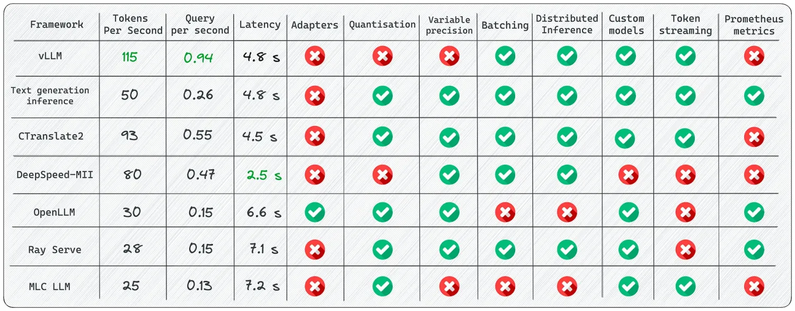

# [vLLM](https://github.com/linkedin/Liger-Kernel)

# [SGLang](https://github.com/sgl-project/sglang)

# 

# [SkyPilot](https://github.com/skypilot-org/skypilot)
# [TensorRT-LLM](https://github.com/NVIDIA/TensorRT-LLM) 
# [OpenVino](https://github.com/openvinotoolkit/openvino)
# [TGI](https://github.com/huggingface/text-generation-inference)
# [Xinference](https://inference.readthedocs.io/)