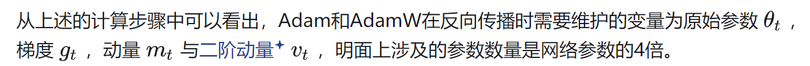
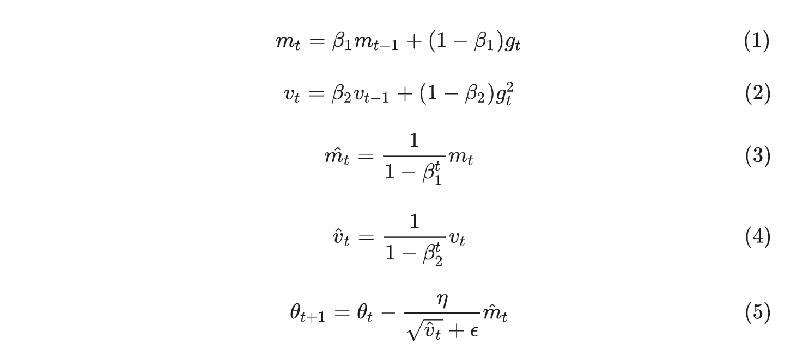

# Adam and AdamW
需要保存的参数
原始参数 
梯度 gt 
动量 mt 
二阶动量 vt

*也就是说训练的时候 保存的参数量是网络参数的4倍*

### 还需要保存每层的激活值

总之，“每一层的激活信息”是指每一层在正向传播时产生的输出张量。它们在进行反向传播时会被用来计算梯度，因此必须先暂存在显存中。这部分中间激活值往往是大模型训练中显存占用的大头之一。

动量mt和二阶动量vt 初次接触的时候 感觉难以理解
其实只要搞明白引入mt和vt是解决什么问题的 就好理解了

 对于大型模型而言，每一层的激活张量往往具有较高的维度（如 batch size、sequence length、hidden size 等都比较大），导致激活信息本身格外庞大。

## 带有动量的梯度mtm_tm_t：为什么要用带有动量的梯度替换梯度？
1.sgd直接给权重减去梯度，有时候会遇到震荡不收敛的情况，这是因为每次迭代过后梯度变化过大导致的。
因此，解决这种问题的方法就是引入动量，在更新权重的时候，不仅考虑当前的梯度，也考虑历史的梯度，对于带有动量的梯度mtm_tm_t,其需要存储历史梯度的移动平均值(moving average of past  gradients)，也称为一阶动量。

## 为什么要有自适应学习率？
1.深度学习模型中，一些参数可能频繁获得较大的梯度，一些参数可能偶尔获得较大的梯度，如果使用统一的学习率，后者学习的不好。
2.因此，研究者提出：自适应的学习率，如果一个参数，历史的梯度很大，那么降低其学习率，如果历史梯度很小，那么增加其学习率。因此，通过在权重更新的时候，让梯度除根号下二阶动量来实现这个功能。（见下面权重更新的公式）

### 为什么NLP模型通常使用AdamW作为优化器，而不是SGD？
https://www.zhihu.com/question/616972642/answer/3624827337?utm_campaign=shareopn&utm_medium=social&utm_psn=1865096532107329536&utm_source=wechat_session
