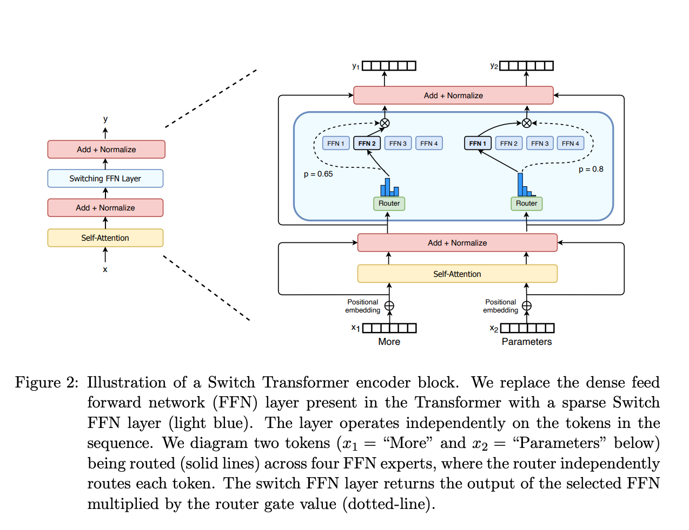

## llm并行训练策略？
dp 
tp 
pipeline：
类似olap引擎里面的sql执行引擎的 pipeline并行，因为都是计算图
只不过这里是按照模型的层进行切分 一层就是一个pipeline 分不到多个gpu上执行

## tp都是哪些策略？ 
主要策略就是下面的两个
1.层级并行(*主要的*)
把模型按层进行切分

2.Tensor Slicing(*主要的*)
在某一层中，将权重矩阵进行切分，分别存储到不同的节点上去

其他的策略不是很常见
3.分块并行(Sharding)

4.子模块并行(Submodel Parallelism)
切分成子模型

5.动态并行(Dynamic Parallelism)

6.流水线并行(Pipeline Parallelism)

## 讲一下Transformer的模型架构

Multi-head Attention
主要就是多头注意力层
比如 8个头 每个头都有一套自己的Q,K,V 都乘以对应的X
然后将8个头进行拼接 成最后的embedding维度 

### Post-Norm
原始的Transformer架构(2017 Attention is All You Need)中采用的是"Post-Norm",即:

先进行Self-Attention/FFN
然后做Layer Normalization

###  Pre-Norm
后续的LLM基本都采用的是"Pre-Norm"
1. 训练更稳定,收敛更快
2. 允许使用更大的学习率
3. 更容易训练深层网络
x -> Norm -> Self-Attention -> Add -> Norm -> FFN -> Add

## Qwen2使用的optimizer

## 对比一下Adam vs AdamW， AdamW的超参数都有哪些

## 解释一下MoE
是在哪一层使用了MoE 
As a substitute for the original FFN, the MoE FFN consists of n individual FFNs, FFN这一层 而不是在self attention

