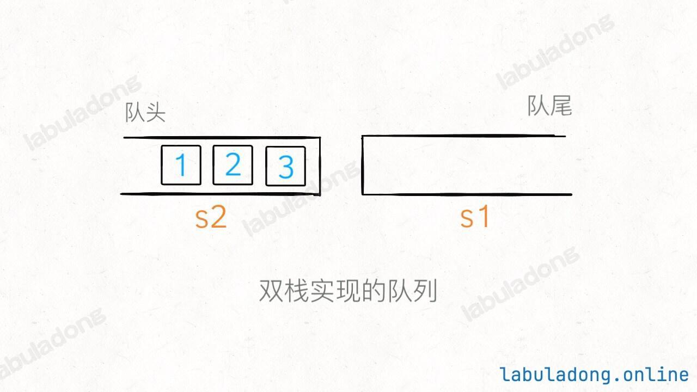

# 面试

笔刷题目
## 面试经典150题
https://leetcode.cn/studyplan/top-interview-150/

## 88题
https://leetcode.cn/studyplan/selected-coding-interview/

## 75
https://leetcode.cn/studyplan/leetcode-75/

时间复杂度 空间复杂度
要做到看到题目 张口就来的可以说出思路 

# stack栈
| 题目 | 描述 | 难度 | 思路 |
| ---- | ---- | ---- | ---- |
| [20. 有效的括号](https://leetcode.cn/problems/valid-parentheses/description/) | sdfsdfds | 简单 | 使用栈 将左括号入栈，遇到右括号时判断栈顶是否为对应的左括号，是则出栈，否返回false。 |
| [232. 用栈实现队列](https://leetcode.cn/problems/valid-parentheses/description/) | sdfsdfds | 简单 | 使用两个栈 将元素入栈，当栈顶元素为空时，将栈顶元素出栈，如果栈顶元素不为空，则将栈顶元素出栈，将栈顶元素入栈，直到栈顶元素为空，将栈顶元素出栈，将栈顶元素入栈，直到栈顶元素为空，将栈顶元素出栈，将栈顶元素入栈，直到栈顶元素为空，将栈    需要将队尾栈元素全部倒腾到队首栈 |

# 链表
| 题目 | 描述 | 难度 | 思路 |
| ---- | ---- | ---- | ---- |
| [141. 环形链表](https://leetcode.cn/problems/valid-parentheses/description/) | sdfsdfds | 简单 | 使用快慢指针 快指针走两步，慢指针走一步，如果快慢指针相遇，则说明有环 |
| [21. 合并两个有序链表](https://leetcode.cn/problems/valid-parentheses/description/) | sdfsdfds | 简单 | 两个指针 分别指向两个链表，比较两个指针的值，小的值放入新链表中，直到其中一个链表为空，将另一个链表剩余的节点全部加入新链表中 |
| [206. 反转链表](https://leetcode.cn/problems/valid-parentheses/description/) | sdfsdfds | 简单 | 三个指针，一个指向当前节点，一个指向当前节点的下一个节点，一个指向当前节点的上一个节点，依次将当前节点的下一个节点指向前一个节点，直到当前节点为空，返回新链表头节点|

# 区间
| 题目 | 描述 | 难度 | 思路 |
| ---- | ---- | ---- | ---- |
| [20. 有效的括号](https://leetcode.cn/problems/valid-parentheses/description/) | sdfsdfds | 简单 | 使用栈 将左括号入栈，遇到右括号时判断栈顶是否为对应的左括号，是则出栈，否返回false。 |

# 哈希表
| 题目 | 描述 | 难度 | 思路 |
| ---- | ---- | ---- | ---- |
| [20. 两数之和](https://leetcode.cn/problems/valid-parentheses/description/) | sdfsdfds | 简单 | 使用左右指针 将数组分为左右两部分，左指针指向头，右指针指向尾，如果左指针的值大于右指针的值，则交换两个指针的值，直到左指针的值小于右指针的值，然后从左指针开始遍历，如果当前值与右指针的值之和等于目标值，则返回两个指针的值，否则将右指针向左移动一位，直到左指针的值大于右指针的值 |

# 一维动态规划
| 题目 | 描述 | 难度 | 思路 |
| ---- | ---- | ---- | ---- |
| [20. 爬梯子](https://leetcode.cn/problems/valid-parentheses/description/) | sdfsdfds | 简单 | 动态规划 状态转移方程 f(i) = f(i-1) + f(i-2) 初始值 f(0) = 1 f(1) = 1|

# 多维动态规划
| 题目 | 描述 | 难度 | 思路 |
| ---- | ---- | ---- | ---- |
| [20. 两数之和](https://leetcode.cn/problems/valid-parentheses/description/) | sdfsdfds | 简单 | 使用左右指针 将数组分为左右两部分，左指针指向头，右指针指向尾，如果左指针的值大于右指针的值，则交换两个指针的值，直到左指针的值小于右指针的值，然后从左指针开始遍历，如果当前值与右指针的值之和等于目标值，则返回两个指针的值，否则将右指针向左移动一位，直到左指针的值大于右指针的值 |

