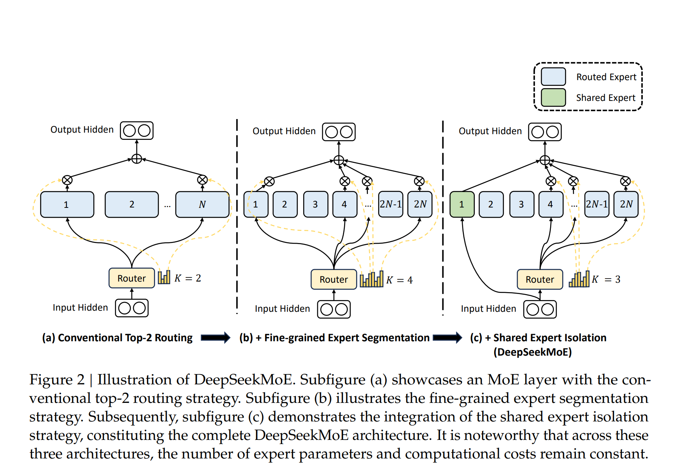
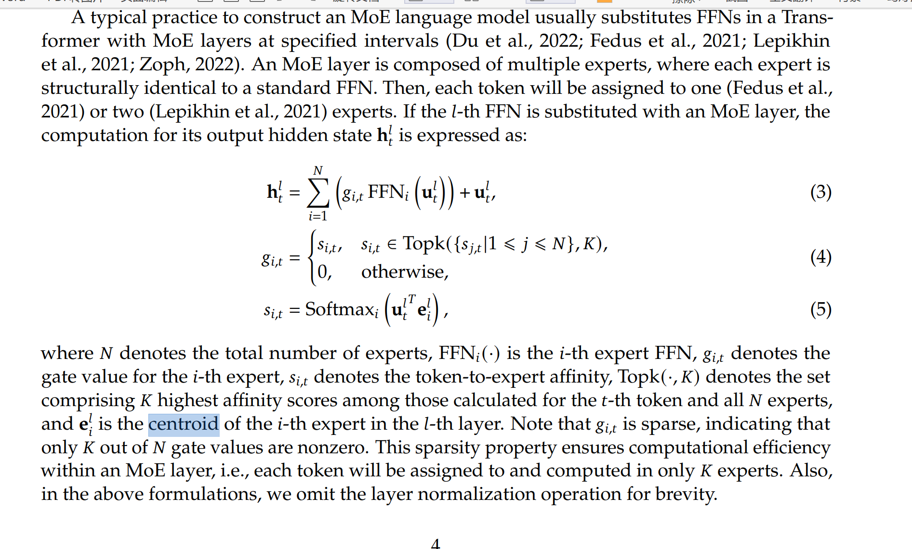

## Routing Algorithms:

1. Top-k routing: This is the simplest method. The gating network picks the top 'k' experts with the highest affinity scores and sends the input data to them.
2. Expert choice routing: In this method, instead of the data choosing the experts, the experts decide which data they can handle best. This strategy aims to achieve the best load balancing and allows for a varied way of mapping data to experts.
3. Sparse routing: This approach only activates a few experts for each piece of data, creating a sparse network. Sparse routing uses less computational power compared to dense routing, where all experts are active for every piece of data.

# Generic MoE Architecture


1. Affinity scores (亲和度分数):
在MoE (Mixture of Experts)中，affinity score表示输入token和专家(expert)之间的匹配程度
通过公式(5)计算: si,t = Softmax(ui^T * ei)，即token的隐藏状态和专家centroid的点积
affinity score越高，表示该token越适合由该专家处理

2. Centroid (质心/中心点):
ei 表示第i个专家的centroid向量
可以理解为表示这个专家"擅长处理"什么类型输入的特征向量
centroid作为一个可学习的参数，在训练过程中不断优化
整个流程是：

计算每个token与所有专家的affinity scores
选择Top-K个最高的affinity scores对应的专家
只让选中的K个专家处理该token
最终输出是这K个专家输出的加权组合
这种机制确保了:

每个token只由最匹配的K个专家处理
计算效率高(稀疏性)
专家可以专门化处理不同类型的输入


> DeepSeekMoE  这篇技术报告上面解释的很清楚
>> Towards Ultimate Expert Specialization in
>> Mixture-of-Experts Language Models


# DeepSeekMoE
## Fine-Grained Expert Segmentation (细粒度专家分割):
主要思想:

将每个专家(expert)分割成更小的专家,但保持总参数量不变
相应地增加被激活的专家数量,以保持计算成本不变
具体做法:

将每个专家的FFN中间隐藏层维度减少到原来的1/m
相应地将专家总数从N增加到mN
激活的专家数量从K增加到mK
优点:

使不同类型的知识可以被更细致地分解到不同的专家中
提供了更灵活的专家组合方式
每个专家可以更专注于特定类型的知识
大大增加了可能的专家组合数量,提升了模型的表达能力

## Shared Expert Isolation (共享专家隔离):
主要思想:

将一部分专家隔离出来作为共享专家,始终被激活
这些**共享专家**负责捕获**通用知识**
其他**路由专家**可以更专注于**特定领域知识**
具体做法:

将Ks个专家设置为共享专家
每个token都会经过这些共享专家的处理
为保持计算成本不变,相应减少激活的路由专家数量
优点:

减少专家之间的知识冗余
共享专家可以处理通用知识,使路由专家更专注
提高参数利用效率
每个专家可以获得更明确的分工


Expert-Level Balance Loss和Device-Level Balance Loss的设计主要是为了解决MoE模型在训练过程中的两个关键问题：

## Expert-Level Balance Loss (专家级别平衡损失)
主要目的：

防止 **路由崩溃(routing collapse)** 现象
确保所有专家都能得到充分训练
问题背景：

如果没有这个损失,模型可能总是选择同一些专家
其他专家可能得不到足够的训练机会
这会导致模型无法充分利用所有专家的能力
计算方式：

excel

复制
LExpBal = α1 ∑(i=1 to N') fi * Pi

其中：
fi = (N'/(K'T)) ∑(t=1 to T) 1(Token t selects Expert i)
Pi = (1/T) ∑(t=1 to T) si,t

## Device-Level Balance Loss (设备级别平衡损失)
主要目的：

确保在多设备部署时计算负载均衡
减少计算瓶颈
提高分布式训练效率
问题背景：

当专家分布在多个设备上时
如果负载不均衡会造成某些设备过载
导致整体训练速度受限于最慢的设备
计算方式：

less

复制
LDevBal = α2 ∑(i=1 to D) f'i * P'i

其中：
f'i = (1/|Ei|) ∑(j∈Ei) fj
P'i = ∑(j∈Ei) Pj
实际应用策略：

Expert-Level Balance Loss使用较小的权重(α1)
仅用于防止路由崩溃
过强的约束会影响模型性能
Device-Level Balance Loss使用较大的权重(α2)
重点确保设备间计算均衡
对训练效率影响更大
这两种损失的重要性：

训练稳定性：
防止训练过程中出现专家或设备负载严重不均衡
确保训练过程的稳定性
提高模型收敛质量
计算效率：
合理分配计算资源
避免资源浪费
提高训练速度
模型性能：
确保所有专家得到充分训练
充分利用模型容量
提升最终性能
因此,这两个损失函数是保证MoE模型能够高效稳定训练的重要组成部分。它们共同作用,既保证了模型训练的质量,又提高了训练效率。


这些损失函数会与主要的token预测损失(通常是交叉熵损失)一起组成最终的总损失函数。总损失函数的计算方式大致如下:
```python
Total Loss = Token Prediction Loss + α1 * Expert Balance Loss + α2 * Device Balance Loss

其中:
- Token Prediction Loss: 主要的语言模型预测损失(交叉熵)
- α1: Expert-Level Balance Loss的权重(较小,如0.001-0.01)
- α2: Device-Level Balance Loss的权重(较大,如0.05)
```
