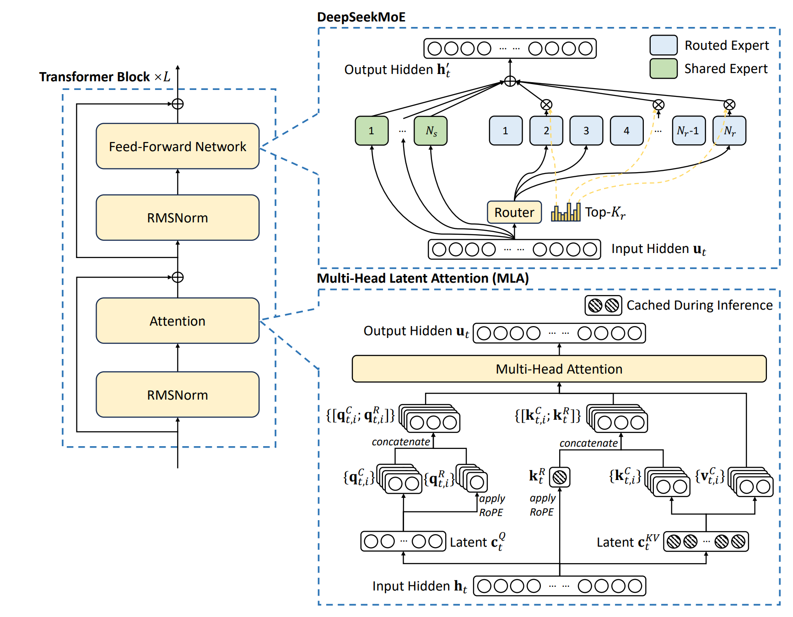
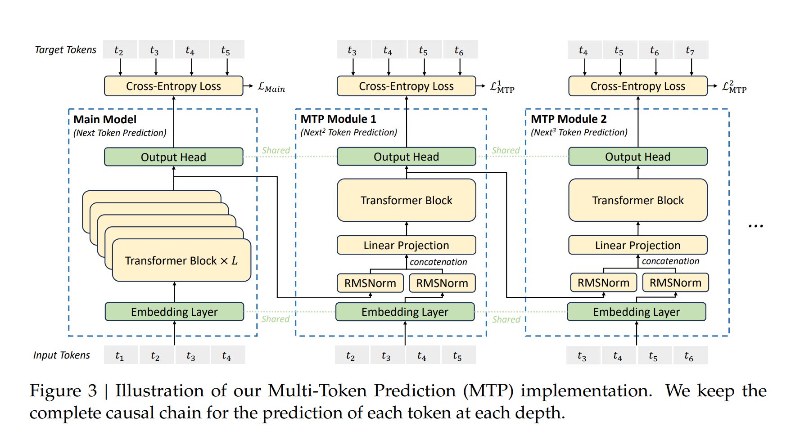

# Deepseek v3

https://github.com/deepseek-ai/DeepSeek-V3

HAI-LLM框架
https://www.high-flyer.cn/en/blog/hai-llm/

Preffx-Sufffx-Middle (PSM) vs FIM

Long Context Extension
YaRN

## DeepSeekMoE for economical training
Multi-head Latent Attention (MLA) (DeepSeek-AI, 2024c) for efffcient inference
DeepSeekMoE (Dai et al., 2024) for economical training

256 routing experts + 1 shared expert
8 activated experts for each token

## Multi-head Latent Attention MLA for efffcient inference 

## Load Balancing Strategy :auxiliary-loss-free strategy

FP8 mixed precision training 

DualPipe algorithm

## Training Objective: MTP(Multi-Token Prediction)

## HyperParams
14.8T tokens
sequence length: 4k > 32k > 128k

### RMSNorm

### AdamW Optimizer
beta1 = 0.9, beta2 = 0.95, and weight_decay = 0.1

## Pre-Training

### two phase extension training

# Deepseek R1

## R1-Zero
纯RL 没有经过finetune

##  dataset
具体sample
600k Reasoning data
800k Non-Reasoning data

### RL Algorithm
GRPO

### Reward model

## R1
Step 1: Cold Start Data SFT
Step 2: RL
Step 3: SFT
Step 4: RL

### Distillation
用R1 800k samples 直接finetune Qwen和LLama 这个过程没有RL

源代码

Open R1
https://github.com/huggingface/open-r1

