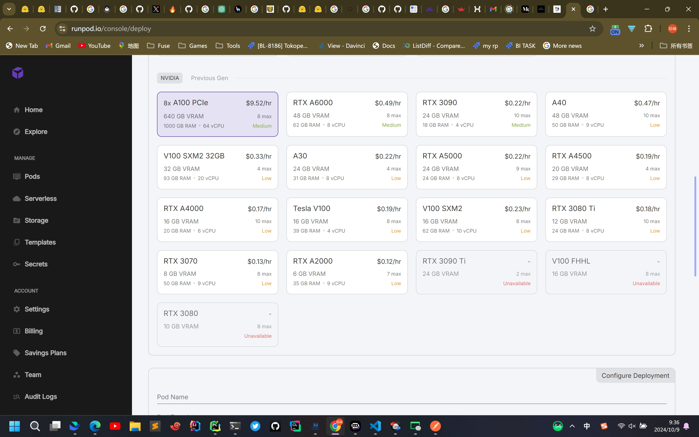
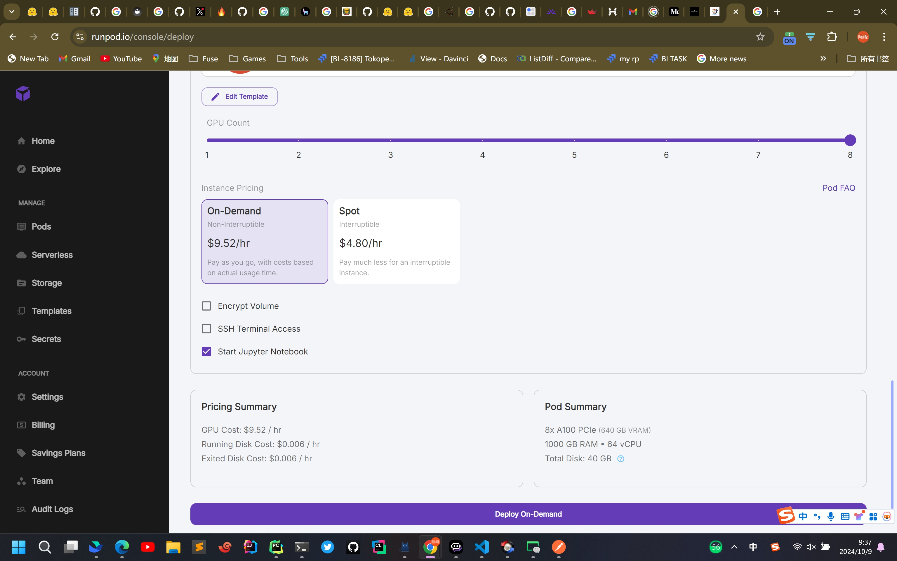

models/gpt2/train.py
自己实现training loop训练gpt2模型

models/gpt2/train_accelerate.py
使用了HF Accelerate对现有的代码进行了改造 便于在多卡, 多机上训练
改动的地方也不多

124MB NANO GPT < 45mins 8xH100 3.5B tokens(<10B tokens)
使用了一种新的optimizer
https://github.com/KellerJordan/modded-nanogpt?tab=readme-ov-file

