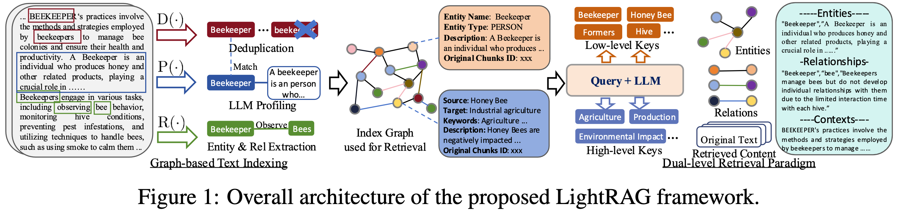

# GraphRAG
GraphRAG 就是利用LLM将文本数据转化为图数据(知识图谱)，然后利用图数据进行问答。 

# Issues

## fact checking
本质上还是需要事先构建好一个知识库
1.没有矛盾，相互冲突的。
2.没有错误事实的


# Frameworks

Fast-GraphRAG
https://github.com/circlemind-ai/fast-graphrag

CircleMind
https://docs.circlemind.co/introduction

LightRAG
https://github.com/HKUDS/LightRAG

Nano-GraphRAG
https://github.com/gusye1234/nano-graphrag

GraphRAG
https://github.com/microsoft/graphrag


# Storage

## PostgreSQL
 as KV store, VectorDB (pgvector) and GraphDB (apache AGE).


## Neo4J
graph storage


# example

让我用一个具体的医学文本示例来说明整个过程：

假设有以下医学文本片段：
阿司匹林是一种常见的非甾体抗炎药，可用于治疗发烧和疼痛。它通过抑制环氧合酶来发挥作用。服用阿司匹林可能导致胃部不适等副作用。


1. 文本预处理
这段文本已经足够简短，无需再切分

2. 知识抽取
使用类似这样的提示词让 LLM 抽取三元组：
"请从以下文本中抽取实体关系三元组，格式为：(实体1, 关系, 实体2)"

LLM 可能输出如下三元组：

```python
(阿司匹林, 是一种, 非甾体抗炎药)
(阿司匹林, 治疗, 发烧)
(阿司匹林, 治疗, 疼痛)
(阿司匹林, 抑制, 环氧合酶)
(阿司匹林, 可能导致, 胃部不适)
```


3. 知识验证
使用 LLM 验证这些三元组的准确性，例如：
"请验证以下医学知识三元组的正确性"
LLM 会确认这些关系是否准确，可能会指出：

所有三元组都符合医学事实
建议将"是一种"规范化为"类型"
建议将"可能导致"规范化为"副作用"

4. 知识图谱构建
规范化后的三元组：

```python
(阿司匹林, 类型, 非甾体抗炎药)
(阿司匹林, 适应症, 发烧)
(阿司匹林, 适应症, 疼痛)
(阿司匹林, 作用机制, 抑制环氧合酶)
(阿司匹林, 副作用, 胃部不适)
```

5. 图谱应用
构建完成后，可以回答如下问题：
Q: 阿司匹林是什么类型的药物？
A: 非甾体抗炎药
Q: 阿司匹林有什么副作用？
A: 胃部不适
如果提供更多文本，图谱会不断扩大：

```python
阿司匹林还可以预防心脏病，建议剂量为每天75-100mg。过量服用可能导致出血风险增加。
```


LLM 会抽取新的三元组：
```python
(阿司匹林, 预防, 心脏病)
(阿司匹林, 推荐剂量, 75-100mg/天)
(阿司匹林, 副作用, 出血风险增加)
```

这样逐步构建的知识图谱会越来越丰富，可以：

发现实体间的隐含关系
支持复杂的推理问题
为医学决策提供支持

使用Neo4J Cypher语言构建图谱：

```sql
// 创建药物节点
CREATE (a:Drug {name: '阿司匹林'})
CREATE (n:DrugCategory {name: '非甾体抗炎药'})

// 创建症状/疾病节点
CREATE (f:Symptom {name: '发烧'})
CREATE (p:Symptom {name: '疼痛'})
CREATE (h:Disease {name: '心脏病'})

// 创建其他节点
CREATE (e:Enzyme {name: '环氧合酶'})
CREATE (s:SideEffect {name: '胃部不适'})
CREATE (b:SideEffect {name: '出血风险增加'})
CREATE (d:Dosage {name: '75-100mg/天'})

// 创建关系
MATCH (a:Drug {name: '阿司匹林'}), (n:DrugCategory {name: '非甾体抗炎药'})
CREATE (a)-[:BELONGS_TO]->(n)

MATCH (a:Drug {name: '阿司匹林'}), (f:Symptom {name: '发烧'})
CREATE (a)-[:TREATS]->(f)

MATCH (a:Drug {name: '阿司匹林'}), (p:Symptom {name: '疼痛'})
CREATE (a)-[:TREATS]->(p)

MATCH (a:Drug {name: '阿司匹林'}), (e:Enzyme {name: '环氧合酶'})
CREATE (a)-[:INHIBITS]->(e)

MATCH (a:Drug {name: '阿司匹林'}), (s:SideEffect {name: '胃部不适'})
CREATE (a)-[:HAS_SIDE_EFFECT]->(s)

MATCH (a:Drug {name: '阿司匹林'}), (h:Disease {name: '心脏病'})
CREATE (a)-[:PREVENTS]->(h)

MATCH (a:Drug {name: '阿司匹林'}), (b:SideEffect {name: '出血风险增加'})
CREATE (a)-[:HAS_SIDE_EFFECT]->(b)

MATCH (a:Drug {name: '阿司匹林'}), (d:Dosage {name: '75-100mg/天'})
CREATE (a)-[:HAS_DOSAGE]->(d)
```


### 使用python操作
```python
from neo4j import GraphDatabase

class Neo4jConnection:
    def __init__(self, uri, user, password):
        self.driver = GraphDatabase.driver(uri, auth=(user, password))
        
    def close(self):
        self.driver.close()
        
    def add_drug_info(self, drug_name, drug_type):
        with self.driver.session() as session:
            # 创建药物节点
            session.run("""
                MERGE (d:Drug {name: $drug_name})
                MERGE (t:DrugCategory {name: $drug_type})
                MERGE (d)-[:BELONGS_TO]->(t)
                """, drug_name=drug_name, drug_type=drug_type)
    
    def add_treatment_relation(self, drug_name, condition):
        with self.driver.session() as session:
            # 添加治疗关系
            session.run("""
                MATCH (d:Drug {name: $drug_name})
                MERGE (c:Condition {name: $condition})
                MERGE (d)-[:TREATS]->(c)
                """, drug_name=drug_name, condition=condition)
    
    def query_drug_info(self, drug_name):
        with self.driver.session() as session:
            # 查询药物信息
            result = session.run("""
                MATCH (d:Drug {name: $drug_name})-[r]->(n)
                RETURN type(r) as relation, n.name as related_info
                """, drug_name=drug_name)
            return [(record["relation"], record["related_info"]) 
                   for record in result]

# 使用示例
conn = Neo4jConnection("bolt://localhost:7687", "neo4j", "password")

# 添加数据
conn.add_drug_info("阿司匹林", "非甾体抗炎药")
conn.add_treatment_relation("阿司匹林", "发烧")

# 查询数据
results = conn.query_drug_info("阿司匹林")
for relation, info in results:
    print(f"{relation}: {info}")

conn.close()
```


