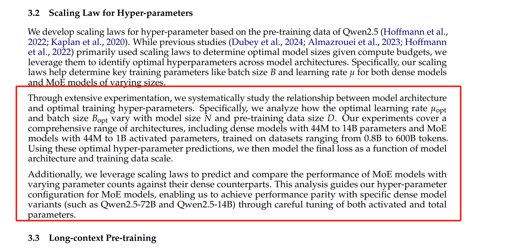
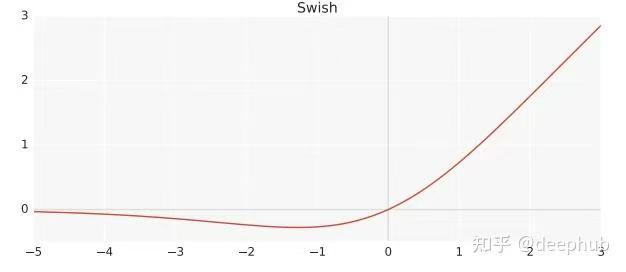

# qwen2.5 

# Pretraining

## Pretraining Data
18TB token

###  Better data ffltering
使用Qwen2过滤

### Better synthetic data

具体的策略？

#### Long-Context Training

##### Dense
two phases
phase 1: 4k
phase 2: 32k

##### MoE
4 phases

两个phase是怎么关联的？

具体的函数是怎么样的？

base model就可以直接评估呢 intruction model

#### Long-Context Inference
YARN (Peng et al., 2023)
Dual Chunk Attention (DCA, An et al., 2024).

# Post-Training
1 million

## SFT
loss是什么， 是怎么个训练过程？ qa 数据集格式

在qwen 0.5B base上开发 sft, dpo, grpo

reward model

## GRPO

# Architecture

# Dense
- Grouped Query Attention (GQA, Ainslie et al., 2023) for efffcient KV cache utilization 
- SwiGLU activation function (Dauphin et al., 2017) for non-linear activation
- Rotary Positional Embeddings (RoPE, Suet al., 2024) for encoding position information
* QKV bias (Su, 2023) in the attention mechanism
* RMSNorm (Jiang et al., 2023b) with pre-normalization to ensure stable training.

1Qwen2.5-Turbo is identiffed as qwen-turbo-2024-11-01 and Qwen2.5-Plus is identiffed as qwen-plus-2024-xx-xx
(to be released) in the API.

AdamW 大模型训练基本使用的都是AdamW

# MoE
Qwen1.5-MoE (Yang et al., 2024a)
ffne-grained expert segmentation (Dai et al., 2024) 
shared experts routing (Rajbhandari et al., 2022; Dai et al., 2024).

# tokenization
BBPE

阿里云提供的qwen 2.5 turbo和plus原来都是 MoE

### SwiGLU activation function
现在的LLM都用SwiGLU,原因是

Swish + GLU
#### Swish
