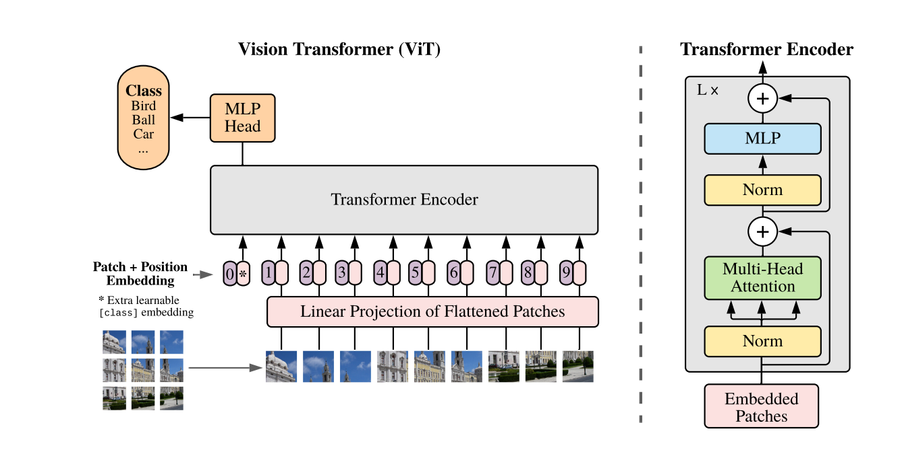
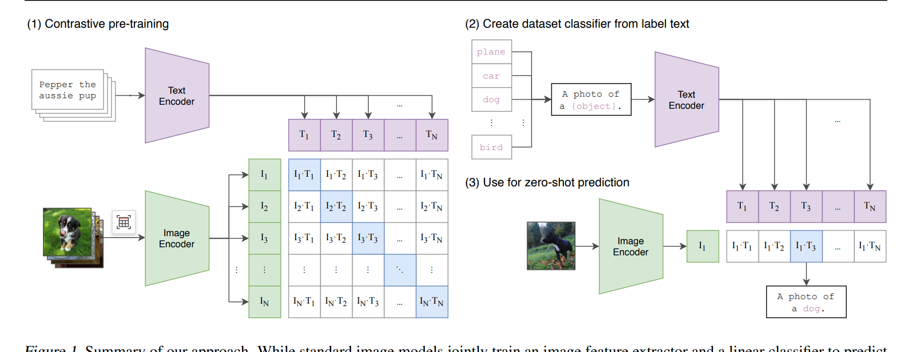

# ViT
Patch + Position Embedding + Transformer

原始论文是将映射成
固定大小的16 * 16的N个patches

N* (H*W*C) > N * (P*P*C)
线性映射
N 个token，然后做Transformer

多头注意力 
N token 映射成了 N token

[彻底改变计算机视觉的 Vision Transformer (ViT) 综合指南（视觉转换器终极指南）](
https://zhuanlan.zhihu.com/p/717741091?utm_campaign=shareopn&utm_medium=social&utm_psn=1863168229167484928&utm_source=wechat_session)

# Clip(OpenClip)

text encoder: gpt2
image encoder: resnet50 and ViT(基本上都是使用的ViT)

qwen2-vl用的就是ViT-BigG

https://github.com/openai/CLIP
https://github.com/mlfoundations/open_clip

# DETR

# Grounding DINO
"Grounding"在计算机视觉和自然语言处理的语境中，指的是将语言描述与视觉元素建立对应关系的过程

举例说明：

输入："找到图片中的红色小狗"
Grounding过程：模型会定位并框出图片中符合"红色小狗"描述的区域

模型架构比较复杂

# Grounding SAM
Open World Detection

