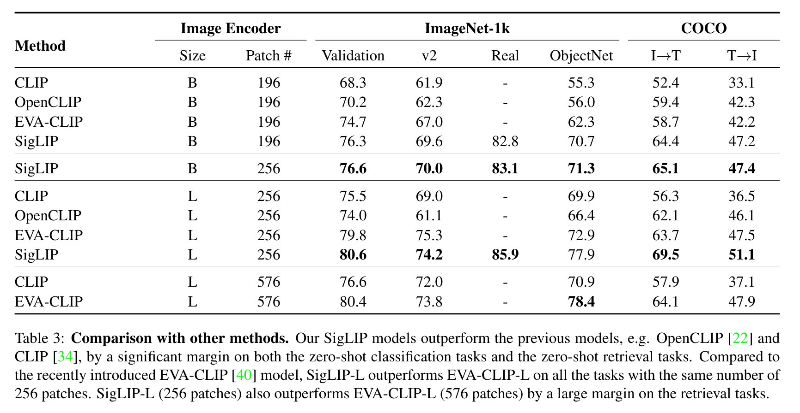

markdown table
| Model | Parameters |
| --- | --- |
| Phi-3-Vision | Parameters |
| CogVLM2 | Parameters |
| PaliGemma | Parameters |
| MiniCPM-V 2.6| Parameters |
| Qwen2-VL | Parameters |
| GLM4V | Parameters |

# Qwen2-VL
Openclip’s ViT-bigG 

# MiniCPM-V 2.6
SigLIP 基于Clip
https://huggingface.co/google/siglip-so400m-patch14-384

# Phi-3-Vision
CLIP ViT-L/14 

# GLM4V
4B-parameter ViT (EVA-E)

# CogVLM
EVA2-CLIP-E

# PaliGemma
SigLIP-So400m
https://huggingface.co/google/siglip-so400m-patch14-384

