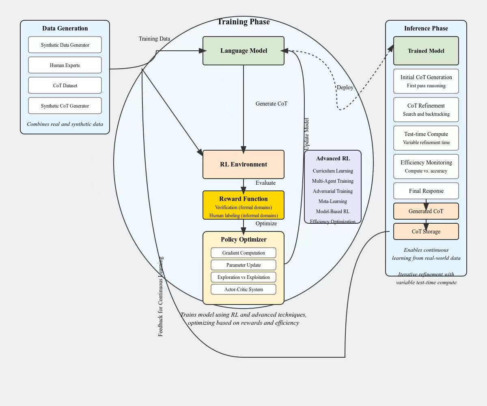

# Github Repo

## Awesome LLM Strawberry (OpenAI o1)
https://github.com/hijkzzz/Awesome-LLM-Strawberry

## Primers • OpenAI O1
https://aman.ai/primers/ai/o1/?s=05

## [Improving LLM Reasoning using SElf-generated data:RL and Verifiers](https://drive.google.com/file/d/1komQ7s9kPPvDx_8AxTh9A6tlfJA0j6dR/view)

## [Reverse Engineering o1 Architecture (With a little help from our friend Claude)](https://www.reddit.com/r/LocalLLaMA/comments/1fgr244/reverse_engineering_o1_architecture_with_a_little/)



[Reverse Engineering OpenAI's o1](https://www.interconnects.ai/p/reverse-engineering-openai-o1)


# usage guide

prompt guide
https://platform.openai.com/docs/guides/reasoning?reasoning-prompt-examples=coding-planning


# Paradigms
```python
1.定义一个task 
详细的任务描述, 例如：在h5上实现车辆的实时检测
定义一个完备的问题 
2.构建好一些sandbox envs
3.定义一些metrics 需要达到一定指标 fps, mAP
4.给定建议solutions 探索solutions
5.自己探索
```


# Technical Keywords:
```markdown
1.RL
2.MCTS(Monte Carlo Tree Search)
3.Self-Play
4.CoT
5.Rationale 推理过程 中间token
```


# Open Source
[g1](https://github.com/bklieger-groq/g1)

