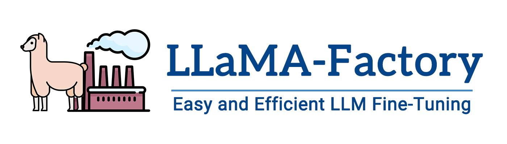
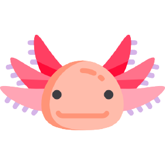

finetuning llms

# [LLaMA-Factory](https://github.com/hiyouga/LLaMA-Factory)
Fine-tuning a large language model can be easy as..

# [Axolotl](https://github.com/axolotl-ai-cloud/axolotl)

# [Unsloth](https://unsloth.ai/)

# [Peft](https://github.com/huggingface/peft)
# [ChatLearn](https://github.com/alibaba/ChatLearn/)
# [Firefly](https://github.com/alibaba/ChatLearn/) 
# [Swift](https://github.com/alibaba/ChatLearn/) 
# [XTuner](https://github.com/InternLM/xtuner)
# [Liger Kernel](https://github.com/linkedin/Liger-Kernel)