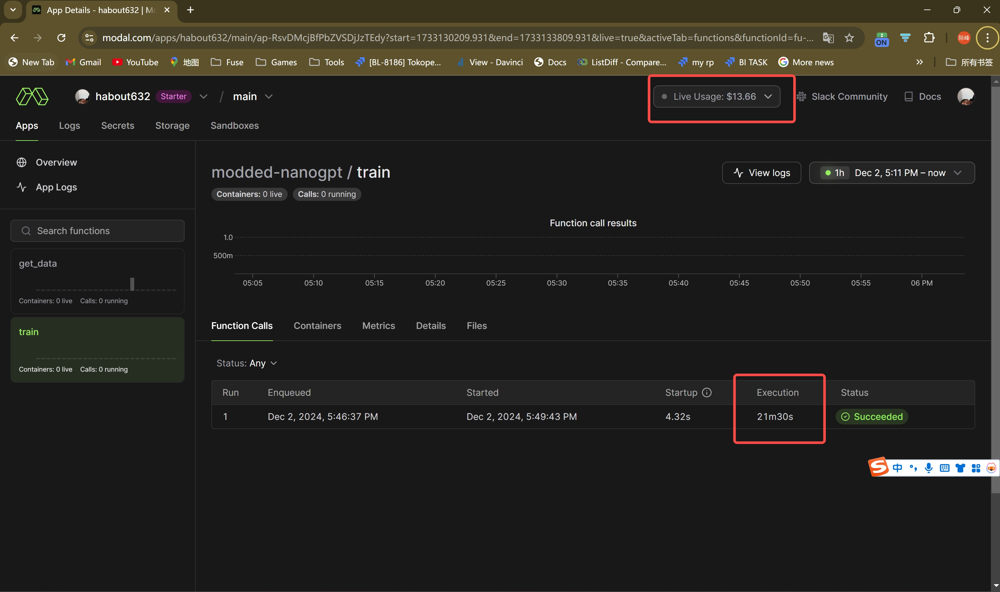

# LLM Pretrain版本的Hello World

* 本次训练费用大概13.68美元(30美元的免费额度，所以相当于完全免费)
* 在8*H100上，大概训练时间20分钟
* 训练数据规模 fineweb ~0.9B tokens

本篇文章是从头预训练一个GPT2@124M GPT2模型(模型大小为124M), 可以完整的实战体验一下LLM预训练的过程。
能够初步体验一下训练好的LLM生成的效果，并且可以自己修改代码，实现一些自己的想法。

这里面的GPT2已经不是最初的版本了，使用了很多优化的技术和特性来提升性能：
* RoPE
* flex attention
* torch.compile(torch.dynamo, torch._inductor)
* ddp
* Muon Optimizer(主要就靠这个optimizer 将训练时间缩短了一半)
跑完整个过程之后，回过头来仔细学习了解这些技术和pytorch特性。有助于了解整个过程。


本篇完全是参考[modded-nanogpt](https://github.com/KellerJordan/modded-nanogpt)
这个repo是一个Speedrun类似比赛，看谁的达到val loss=3.2的时间最短，目前的记录是不到4-5分钟。

模型记录在log目录里面

log链接里面可以看到当时运行的代码,description是每次的改进点，这个speedrun竞速还在继续...


## GPU计算平台
可以使用[modal](https://modal.com/)作为gpu训练平台, modal基本版本为用户每个月提供了30美元的免费额度 
PS.只需要用户使用github账号登录就行, 不用信用卡绑定

使用modal的好处就是不需要登录服务器， 在本地编写使用modal写一些封装的代码 直接在本地运行就可以
会自动上传代码 在modal上帮你构建docker镜像 启动container容器 执行训练
不需要复杂的环境配置


训练使用的是8*H100
在本地开发测试, 可以使用A10G(24GB VRAM) 节省成本


nano gpt 
每个改进都在这里 代码都在log目录下面
https://github.com/alexjc/nanogpt-speedrun/blob/master/records/101024_Muon/train_gpt2.py

# Pretrain

直接启动下面的脚本 开启预训练
```shell
modal run train_with_modal.py
```

modal控制台界面

训练完成的时候， 模型保存在log volume下面(因为使用的docker，挂载了一些data volume)


PS.
train_with_modal.py其实是一个wrapper，把modal的代码封装了一层，方便本地运行
真正的执行脚本是train_gpt2.py

### 说明
1. nanogpt.py是把gpt2模型本身涉及到的文件都提取出来的。移除了ddp分布式，torch.compile相关的为了提升性能的代码。


### dataset
fineweb10B数据是已经处理成了token(bin格式文件). 所以在脚本里面直接使用 不需要使用tokernizer再进行额外处理

https://huggingface.co/datasets/kjj0/fineweb10B-gpt2/tree/main

# 验证训练效果

可以直接运行脚本
```python
modal run use_nanogpt.py
```

使用tell me a story作为初始文本，让训练好的GPT2帮你续写.因为没有经过指令微调，所以现在就是自回归的方式进行next token生成.

```markdown
tell me a story of my life, and how I am to be.
This is the first in our series of blog posts on the subject (which we have done so far with a very small bit of success). The topics are:
- Why does it matter
```

# Eval
使用HellaSwag数据集进行评估,得到的最终分数


```python
acc: 0.2837 acc_norm: 2955/10042=0.2943
```
随机的分数是0.25，比随机分数强点不多。这个没有办法，数据规模和模型参数规模都很小，所以只能得到这么一个结果
gpt的涌现是在1B规模出现的, 所以可以尝试一下0.5B, 1B的效果


运行eval脚本
```shell
modal run eval_with_modal.py
```

eval脚本主要修改的
https://github.com/alexjc/nanogpt-speedrun/blob/master/eval_gpt2.py


# to-do-list
- [ ] 自己了解模型更多的细节
- [ ] 切分成中文数据集
需要一个中文数据集 数据规模刚刚好 @
- https://github.com/mobvoi/seq-monkey-data

- [ ] 指令微调
- [ ] 使用lighteval 在更多的数据集上评估
```markdown
    commonsense_qa (acc/acc_norm)
    hellaswag (acc/acc_norm)
    openbookqa (acc/acc_norm)
    piqa (acc/acc_norm)
    siqa (acc/acc_norm)
    winogrande (acc/acc_norm)
    arc (acc/acc_norm)
    mmlu (acc/acc_norm)
```
- [ ] GPT2 @ 512M
- [ ] GPT2 @ 1B
- [ ] GPT2 @ 1.5B
- [ ] Fineweb 10B
- [ ] Fineweb 100B