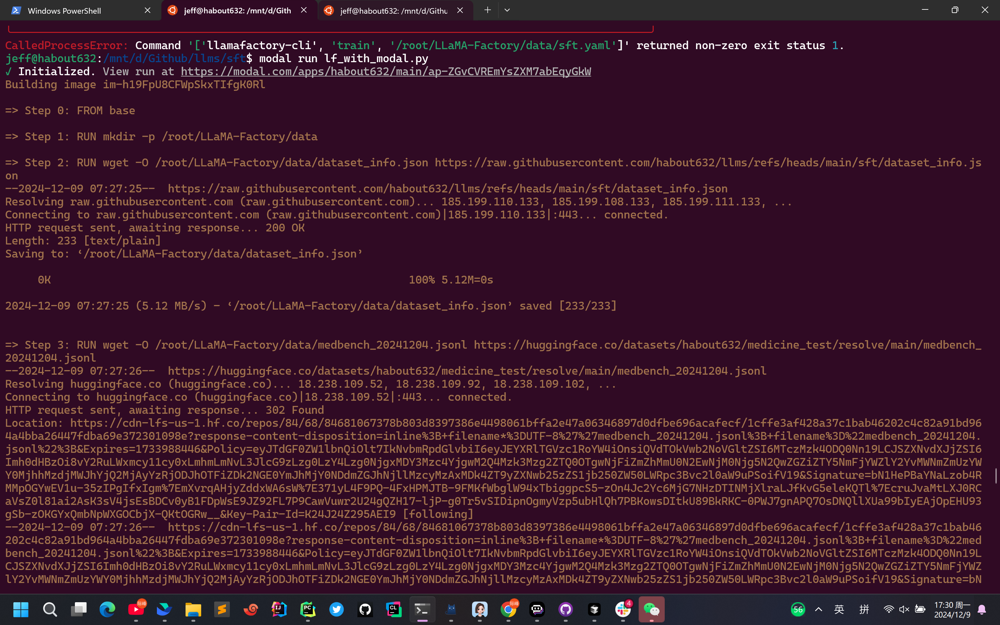

# llama factory with modal 微调简介
使用llama factory对llm进行微调，这里使用[modal](https://modal.com/)作为GPU计算平台
整个过程无需配置GPU环境， 只需要在本地运行python脚本， 会自动上传代码到云端 启动后台训练
modal其实就是自动启动docker容器， 并且自动挂载volume， 并且自动上传代码到volume， 并且自动执行python代码， 并且自动下载数据集。
**modal每个月有30美元的免费额度， 可以使用最多使用10块H100(A100 40G, 80G, A10G)**

# llamafactory with modal 微调过程
直接运行下面的脚本启动微调
```shell
modal run sft_with_modal.py
```



所有的配置都放在了TrainingConfig里面
只需要修改对应的参数就行


```python
@dataclass
class TrainingConfig:
    # Modal 配置
    APP_NAME: str = "med"
    VOLUME_NAME: str = "sft"
    GPU_CONFIG: modal.gpu.GPU = modal.gpu.A100(size="40GB", count=1)
    TIMEOUT_SECONDS: int = 30 * 60

    # 文件路径配置
    ROOT_DIR: str = "/root"
    LLAMA_FACTORY_DIR: str = "/root/LLaMA-Factory"
    DATA_DIR: str = "/root/LLaMA-Factory/data"

    # 目录配置
    ROOT_DIR: str = "/root"
    LLAMA_FACTORY_DIR: str = "/root/LLaMA-Factory"
    DATA_DIR: str = "/root/LLaMA-Factory/data"

    @property
    def DATASET_PATH(self) -> str:
        return os.path.join(self.DATA_DIR, self.DATASET_FILENAME)

    @property
    def CONFIG_PATH(self) -> str:
        return os.path.join(self.DATA_DIR, self.CONFIG_FILENAME)

    @property
    def DATASET_INFO_PATH(self) -> str:
        return os.path.join(self.DATA_DIR, self.DATASET_INFO_FILENAME)

    # URL 配置
    DATASET_URL: str = "https://huggingface.co/datasets/habout632/medicine_test/resolve/main/medbench_20241204.jsonl"
    DATASET_INFO_URL: str = "https://raw.githubusercontent.com/habout632/llms/refs/heads/main/sft/dataset_info.json"
    CONFIG_URL: str = "https://raw.githubusercontent.com/habout632/llms/refs/heads/main/sft/sft.yaml"
```

# TrainConfig对应参数

对于其他没有提到额配置 保持默认就行
## APP_NAME
modala app的名字  直接在代码这里指定就行 不用在网站上配置


## VOLUME_NAME
对应modal上volume的名字  就是docker container上挂载的卷, 直接在代码这里指定就行 不用在网站上配置


## GPU_CONFIG
modal.gpu.GPU = modal.gpu.A100(size="40GB", count=1)
也可以写成"A10G:8"
表示A10G显卡8块

## 文件路径配置
### ROOT_DIR:str = "/root"
保持默认

### LLAMA_FACTORY_DIR: str = "/root/LLaMA-Factory"
保持默认

### DATA_DIR: str = "/root/LLaMA-Factory/data"
保持默认

## URL 配置
### DATASET_URL: str = "https://raw.githubusercontent.com/hiyouga/LLaMA-Factory/refs/heads/main/data/alpaca_zh_demo.json"
微调数据集文件

### DATASET_INFO_URL: str = "https://raw.githubusercontent.com/habout632/llms/refs/heads/main/sft/demo/dataset_info.json"
dataset_info.json llamafactor用到的配置dataset文件 

### CONFIG_URL: str = "https://raw.githubusercontent.com/habout632/llms/refs/heads/main/sft/demo/sft.yaml"
llamafactory用到的配置文件


# 训练结果
训练结果保存在/data/sft/output/目录下 也就是sft volume上面


